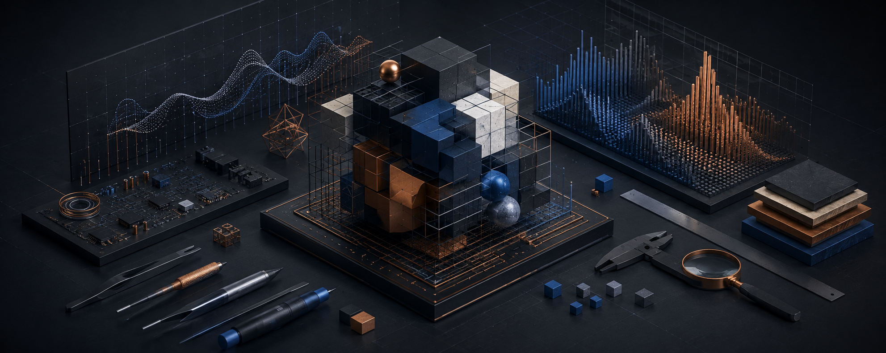
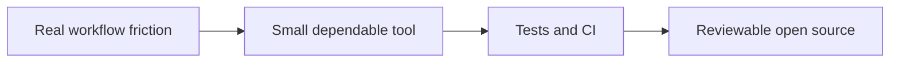

# Small developer tools you can try today

I build local tools for reviewing performance, CI configuration, and coding-agent instructions. **Current focus: making saved benchmark runs easier to compare.**

## Start with BenchDelta

Two Hyperfine JSON exports → a before/after comparison, configurable regression budget, and Markdown you can copy into a review.

**[Get the browser ZIP — no installation](https://github.com/al1re3a/benchdelta-report/releases/latest)** · [English quick start](https://github.com/al1re3a/benchdelta-report/blob/main/README.en.md) · [راهنمای فارسی](https://github.com/al1re3a/benchdelta-report)

The comparison runs locally. It highlights mean changes; it does not establish statistical significance.

## Other useful starting points

- **[Agent Rule Conflicts](https://github.com/al1re3a/agent-rule-conflicts)** — inspect coding-agent instructions for potential contradictions.
- **[MatrixCart](https://github.com/al1re3a/matrixcart)** — expand static GitHub Actions matrices, including `include` / `exclude`, before spending runner time.

Try a tool on your own workflow and tell me where it falls short through its issue tracker. Follow for releases and concrete improvements to these tools.

**فارسی:** تمرکز فعلی روی بهترشدن همین ابزارهای قابل‌استفاده است. تجربهٔ استفاده و مثال کوچکِ بدون اطلاعات حساس را در Issues پروژه بنویسید.

---

<!-- readme-refresh:start -->

  <picture>
    <source media="(prefers-color-scheme: dark)" srcset="assets/readme-banner.png">
    <source media="(prefers-color-scheme: light)" srcset="assets/readme-banner.png">
    
  </picture>

<h1 align="center">👋 al1re3a</h1>

  

  
  

  

> [!NOTE]
> My public tools favor deterministic behavior, local-first workflows, explicit limitations, and outputs that are easy to review or automate.

## 🔎 At a glance

| | |
|---|---|
| **Focus** | Systems programming and developer tooling |
| **Languages** | Rust · C · C++ · Go · Python · R · Assembly |
| **Approach** | Small scope, explicit limits, tests, and CI |
| **Status** | ✅ Building in public |

<strong>🧭 Engineering loop</strong>

---
<!-- readme-refresh:end -->

I work across systems programming, developer tooling, automation, and scientific computing. I enjoy understanding how software behaves below the abstraction layer, then turning that knowledge into reliable, maintainable tools.

## Current focus

- Contributing focused fixes and tests to established open-source projects
- Systems and performance work in Rust, C, C++, and Assembly
- Developer tools and services in Go and Python
- Reproducible data workflows in R and Python

## Languages

## Engineering interests

`systems programming` · `performance` · `embedded` · `compilers` · `developer tooling` · `testing` · `scientific computing`

## Open-source work

I prefer small, reviewable changes backed by tests and aligned with each project's contribution guidelines.

[View my pull requests](https://github.com/pulls?q=is%3Apr+author%3Aal1re3a)
